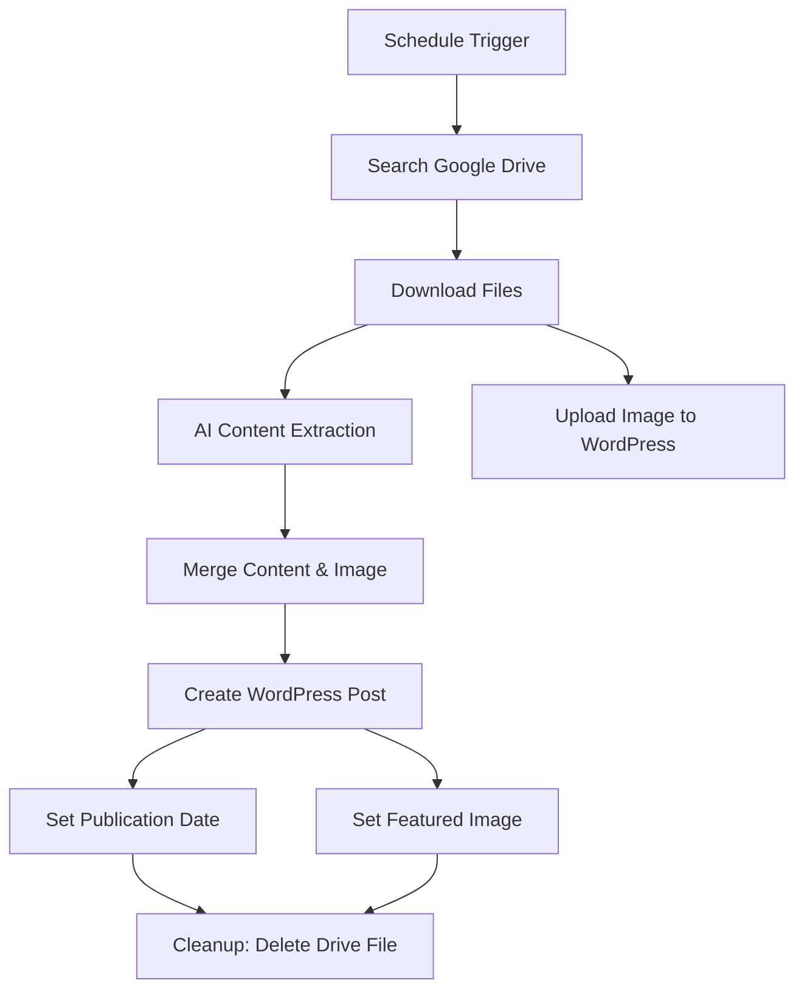

# WordPress Post Automation with n8n

This n8n workflow automates the process of publishing WordPress posts from Google Drive documents using AI content extraction.

## Overview

This workflow automatically:
1. Monitors a Google Drive folder for new documents
2. Downloads and processes document images using AI
3. Extracts structured content from Thai documents
4. Creates and publishes WordPress posts with proper formatting
5. Sets featured images and publication dates
6. Cleans up processed files from Google Drive

## Workflow Components

### 1. Schedule Trigger
- **Node**: `Schedule Trigger`
- **Function**: Runs the workflow at specified intervals
- **Configuration**: Set to run every minute (configurable)

### 2. Google Drive Integration
- **Search Node**: `Search files and folders`
  - Monitors folder: "จดหมายข่าว" (Newsletter)
  - Folder ID: `1DX_j3bDezZ4upDhb0-efYJn2Mszu6n5y`
- **Download Node**: `Download file`
  - Downloads documents for processing
- **Delete Node**: `Delete a file`
  - Removes processed files after successful publication

### 3. AI Content Processing
- **AI Agent**: Powered by Google Gemini 2.5 Flash
- **Function**: Extracts structured data from Thai documents
- **Output Schema**:
  ```json
  {
    "title": "string - News headline without 'จดหมายข่าว' or 'ประชาสัมพันธ์'",
    "date": "string - Thai calendar date from document",
    "details": "string - Complete news content",
    "date_publish": "datetime - ISO 8601 format publication date"
  }
  ```

### 4. WordPress Integration
- **Create Post**: Creates WordPress posts with extracted content
- **Media Upload**: Uploads images to WordPress media library
- **Post Updates**: Sets publication date and featured image
- **Category**: Automatically assigns to category ID 5

### 5. Data Processing Nodes
- **Code Nodes**: Handle data transformation and formatting
- **Merge Nodes**: Combine data from multiple sources
- **Filter Node**: Ensures only valid documents are processed

## Prerequisites

### Required Credentials
1. **Google Drive OAuth2 API**
   - Credential ID: `nYcbKiegP64iYhPy`
   - Name: "Google Drive account"

2. **WordPress API**
   - Credential ID: `SLcGGvLoRGgH0Fw3`
   - Name: "Wordpress account"
   - URL: `https://www.ppks.ac.th`

3. **Google Gemini API**
   - Credential ID: `u7uRe4Ua0KsoQjkW`
   - Name: "Google Gemini(PaLM) Api account"

### Required n8n Packages
- `@n8n/n8n-nodes-langchain` (AI Agent and LangChain nodes)
- Core n8n nodes (Google Drive, WordPress, HTTP Request, etc.)

## Setup Instructions

### 1. Import Workflow
1. Copy the workflow JSON from `automate_publish_wordpress_post.json`
2. Import into your n8n instance
3. Configure all required credentials

### 2. Configure Google Drive
1. Set up Google Drive OAuth2 credentials
2. Ensure access to the target folder
3. Update folder ID if using a different folder

### 3. Configure WordPress
1. Set up WordPress API credentials
2. Update the WordPress site URL if different
3. Adjust category ID as needed (currently set to 5)

### 4. Configure AI Processing
1. Set up Google Gemini API credentials
2. Customize the AI prompt in the "AI Agent" node if needed
3. Adjust the output schema if required

## Workflow Process



## Document Format Requirements

### Expected Input
- Thai language documents (images/PDFs)
- Content should include:
  - Clear headlines
  - Thai calendar dates
  - Detailed content/descriptions
  - Images for featured media

### AI Processing
The AI agent is specifically configured for Thai content with prompts in Thai language. It expects:
- News announcements or newsletters
- School/institutional communications
- Event announcements with dates

## Customization Options

### Modify AI Prompt
Edit the `text` parameter in the "AI Agent" node to change content extraction behavior:

```javascript
// Current prompt extracts: title, date, details, date_publish
// Modify as needed for different document types
```

### Change WordPress Category
Update the `categories` array in the "Create a post" node:

```json
"categories": [5]  // Change to your desired category ID
```

### Adjust Schedule
Modify the "Schedule Trigger" to change execution frequency:
- Current: Every minute
- Options: Hourly, daily, weekly, etc.

## Troubleshooting

### Common Issues
1. **Missing Credentials**: Ensure all three credential types are configured
2. **Google Drive Access**: Verify folder permissions and OAuth scope
3. **WordPress Connection**: Check API endpoint and authentication
4. **AI Processing Failures**: Verify Gemini API quota and document quality

### Error Handling
The workflow includes error handling for:
- Failed file downloads
- AI processing errors
- WordPress API failures
- Missing or malformed data

## Monitoring

### Execution Logs
Monitor workflow executions for:
- Successful post publications
- Failed AI extractions
- WordPress API errors
- Google Drive access issues

### Data Flow Validation
Key checkpoints:
1. File detection in Google Drive
2. Successful AI content extraction
3. WordPress post creation
4. Image upload completion
5. File cleanup

## Security Considerations

- Store all credentials securely in n8n
- Use OAuth2 where possible
- Regularly rotate API keys
- Monitor workflow execution logs
- Limit Google Drive folder access

## Version Information

- **Workflow Version**: 1.0
- **n8n Compatibility**: Requires LangChain nodes
- **Created**: 2025
- **Last Updated**: June 2025

## Support

For issues or modifications:
1. Check n8n execution logs
2. Verify credential configurations
3. Test individual nodes in isolation
4. Review API rate limits and quotas

---

**Note**: This workflow is specifically designed for Thai language content and the ppks.ac.th WordPress site. Modifications may be needed for different languages or WordPress installations.
